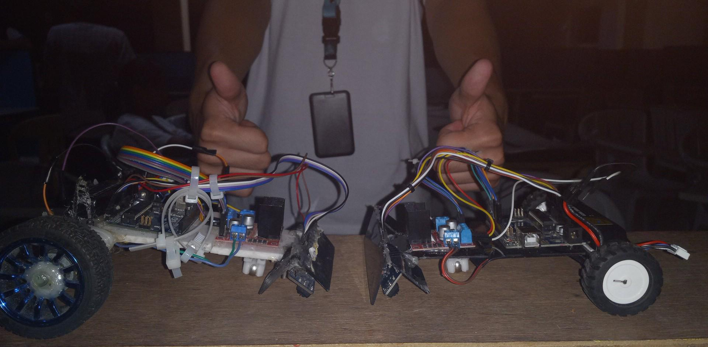
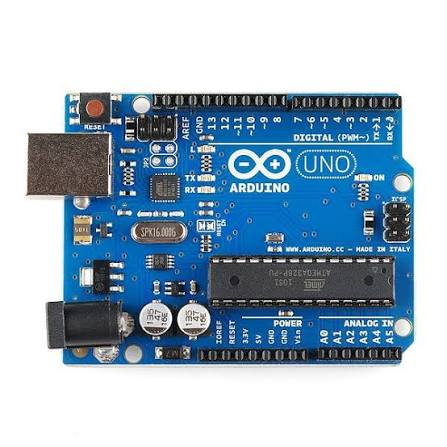
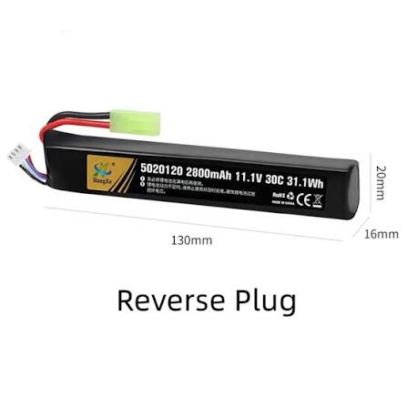
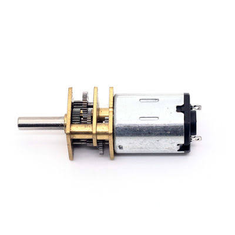
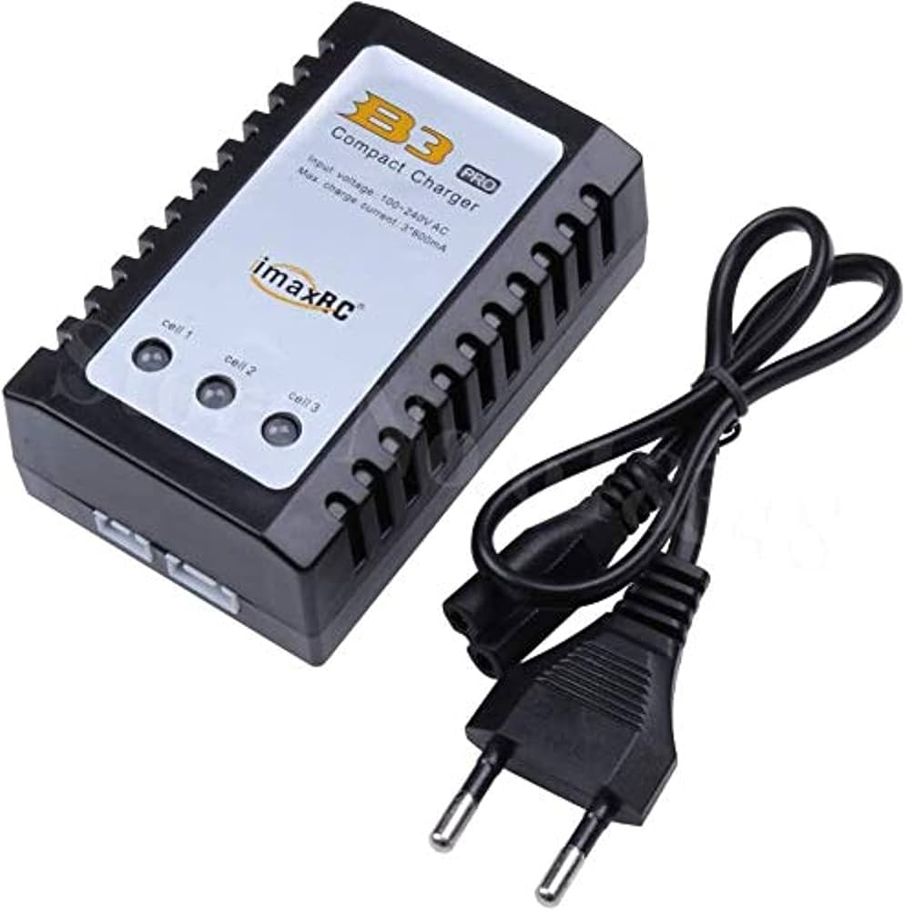
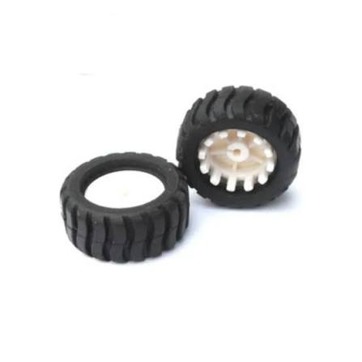
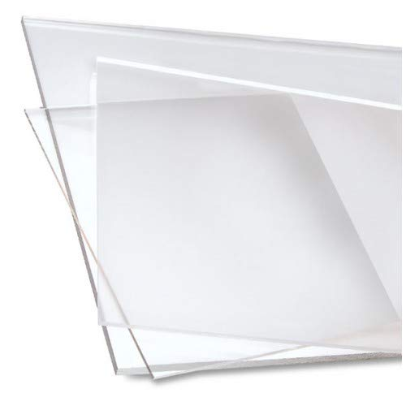
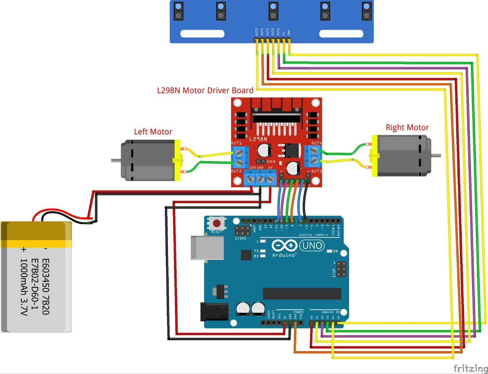

# 🏎️ Line Tracing Robot

## 📖 Introduction
This repository contains the hardware and software documentation for an autonomous Line Tracing Robot. Utilizing a 5-way infrared proximity sensor module and an Arduino Uno, the robot is designed to accurately detect and follow a predefined path. Driven by micro metal DC gear motors and controlled via an L298N motor driver, this project demonstrates foundational concepts in embedded systems, motor control, and sensor-based autonomous navigation.

## 🚀 Final Prototype & Demonstration

  
   
  <i>The fully assembled and wired Line Tracing Robot prototype.</i>

**See it in action!** [🎥 Click here to view the working demonstration and live documentation](https://drive.google.com/drive/folders/1m4bYtQpVCanqK78G1XCWmGIgVv_psRLA?usp=sharing)

## 🛠️ Materials

| Component | Image |
| :--- | :--- |
| **Arduino Uno Rev3** |  |
| **Jumper Wires** |  |
| **5-way infrared proximity line tracker sensor module** |  |
| **L298N DC dual H-Bridge stepper motor driver board module** |  |
| **Rechargeable lithium battery 11.1V 2800mAh 30C with SM plug** |  |
| **Micro metal DC gear motor 6V 500RPM JGA12-N20 (x2)** | |
| **USB Type A to Type B cable** |  |
| **IMAXRC B3 pro compact charger AC 2S 3S RC lipo battery adapter 11.1V** |  |
| **N20 mini wheel and bracket set** |  |
| **N20 W420 small steel ball universal wheel** |  |
| **Acrylic chassis** |  |

## 📐 Diagrams
### Schematic Diagram

  

### Circuit Diagram

  

## 🔌 Wiring Connections

| Module | Component Pin/Terminal | Arduino / Target Connection |
| :--- | :--- | :--- |
| **Power Supply** | Positive (+) | L298N 12V (VCC) |
| | Negative (-) | L298N GND |
| **L298N Motor Driver** | IN1 | D10 |
| | IN2 | D9 |
| | IN3 | D8 |
| | IN4 | D7 |
| | ENA | D11 |
| | ENB | D6 |
| | GND | Arduino GND |
| | 5V | Arduino Vin |
| **DC Motors** | OUT1 / OUT2 | Left Motor |
| | OUT3 / OUT4 | Right Motor |
| **IR Sensor (5-Way)** | VCC | Arduino 5V |
| | GND | Arduino GND |
| | OUT1 | A0 |
| | OUT2 | A1 |
| | OUT3 | A2 |
| | OUT4 | A3 |
| | OUT5 | A5 |

## 🔀 Code Flowchart

  

## 🧪 Testing and Debugging

### A. Step-by-Step Testing Process
Before deploying the robot on the track, the following factors are verified:
1. **Inspecting the Hardware:** Ensure that all wires are not loose and that sensors, motors, wheels, and other components are securely mounted.
2. **Checking the Power Supply:** Ensure that the battery is fully charged and delivering stable power.
3. **Code Verification:** Ensure the correct firmware is compiled and uploaded to the microcontroller.
4. **Calibrate Threshold:** Adjust the sensor threshold in the code to clearly distinguish between the black line and the white surface.

Once these conditions are met, the robot is placed on the line-tracing track. Data is collected by measuring lap times and documenting any deviations during the run, followed by a thorough data analysis.

### B. Common Issues and Solutions

* **Issue: The robot goes off the line.**
  * *Solutions:* * Adjust the PWM speed for the motors.
    * Use wider and more consistent lines on the track.
    * Reduce the base turning speed in the code.
* **Issue: Robot vibrates or moves erratically.**
  * *Solution:* Reinforce the chassis and secure the wheels/brackets tightly.
* **Issue: Power interruptions or sudden stops.**
  * *Solution:* Recharge the LiPo battery.
* **Issue: Unresponsive sensors or motors.**
  * *Solution:* Inspect for loose wires; ensure proper connections between the Arduino, sensors, and L298N driver.

### C. Performance Evaluation
To evaluate the performance of the Line Tracker Robot, a series of tests are conducted to assess its ability to accurately follow a predefined path while maintaining stability and speed.

#### Test Environment Setup
* **Track Details:** The test track is built using white plywood with a 1-inch thick black electrical tape forming a continuous line. It includes straight sections, gentle curves, and sharp turns to simulate real-world navigation challenges. 
* **Location:** All tests are conducted indoors at the CCS, fourth floor, Fab Lab 2, the standby area, and Room ICT-3C.

#### Evaluation Criteria
* **Accuracy:** How well the robot follows the line without veering off.
* **Speed:** The total time taken to complete one full lap of the track.
* **Consistency:** The reproducibility of successful results over multiple runs.

#### Test Procedure
The robot is tested with at least three (3) trials on the same track. For each trial, the following data is recorded:
* Time taken to complete the course.
* Number of times the robot veered off the line.
* Number of successful, uninterrupted trials.

#### Data Recording and Tools
Data is recorded in real-time and verified through video playback. A stopwatch is utilized for precise lap timing, and video recording ensures accurate documentation of time and any path deviation events.

---

## 👤 Author
**Princess April Castillo** *BS Computer Applications, Major in Internet of Things (IoT)*
